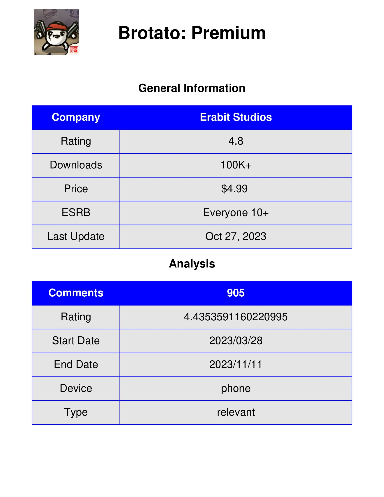
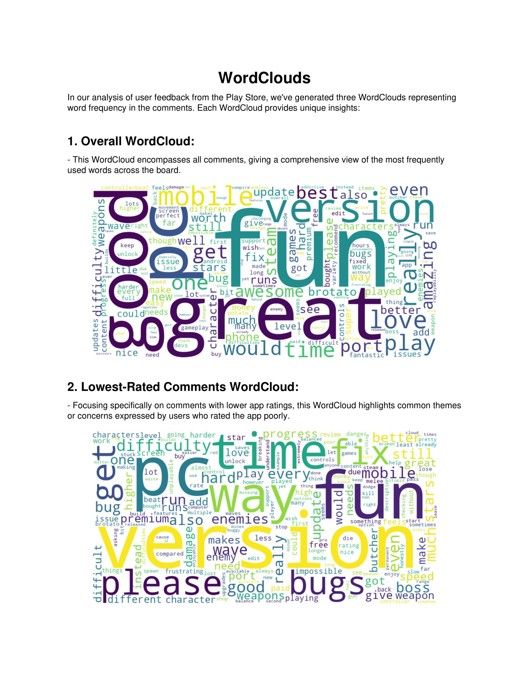
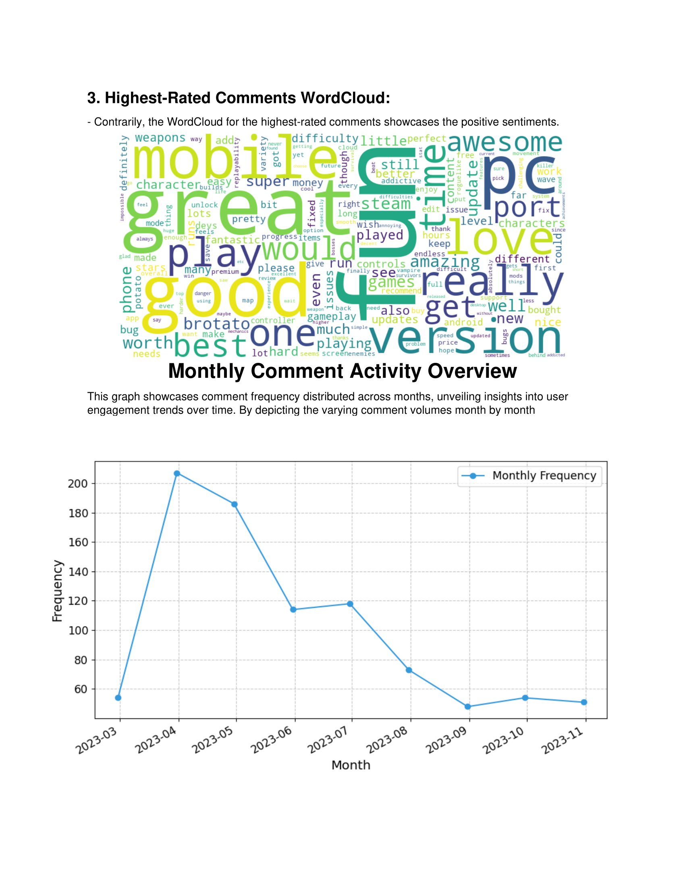

# Play Store Comment Analysis
Python tool for analyzing comments and creating detailed PDF reports and Excel and CSV files.
## Contents

- [Description](#description)
- [Features](#features)
- [Installation](#installation)
- [How to Use](#how-to-use)
- [Real example](#real-example)
- [Contribute](#contribute)

## Description
This repository contains Python scripts that scrape and extract data from the Play Store to generate detailed PDF reports with analysis.
## Features

- Scape Coments from Play Store.
- Generate a PDF file with the extracted information and various analyses.
- Generate Excel and CSV files to store the data.
- Can use pretrained AI models for sentiment analysis.

## Installation

1. Clone this repository:

    ```bash
    git clone https://github.com/your_username/your_project.git
    ```

2. Create a virtual environment and activate it:

    ```bash
    cd scrape_play_store
    python -m venv venv
    source venv/bin/activate   # For Windows: venv\Scripts\activate
    ```

3. Install the dependencies:

    ```bash
    pip install -r requirements.txt
    ```

## How to Use

To execute the main script, use the following arguments:

- `url`: URL of the game or application on the Play Store
- `device`: Type of device to fetch comments from; can be "phone," "tablet," or "chromebook"
- `type`: Type of comment retrieval; use "relevant" for the most relevant comments or "newest" for comments in the order they were posted
- `sentiment`: Boolean (False/True) for sentiment analysis using a pre-trained AI model (Note: enabling this may slow down execution)
- `iteration`: Number of iterations to collect comments, roughly 33 iterations fetch about 1000 comments

```bash
python main.py url=<game_or_app_URL> device=<device_type> type=<comment_type> sentiment=<False/True> iteration=<number_of_iterations>
```

## Real example

url=https://play.google.com/store/apps/details?id=com.brotato.shooting.survivors.games.paid.android&hl=en_419&gl=US
```bash
python main.py url=url device="phone" type="relevant" sentiment=False iteration=30
```
 This will generate an Excel file and a CSV file in their respective folders, as well as the following PDF:





## Contribute

If you wish to contribute to this project, we welcome collaborations! 
